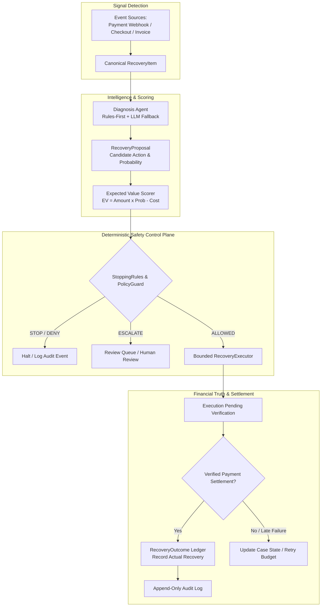

# RecoverOS — Autonomous Revenue Recovery Control Plane

> **RecoverOS is an AI revenue recovery agent that finds money at risk, understands why it is stuck, chooses a bounded intervention, and verifies the money actually came back.**

> **Signature Architecture Axiom:** *AI decides what to try. Policy decides what is allowed. Settlement decides what counts.*

---

## 1. Executive Summary & Core Value Proposition

Revenue is lost across five distinct surfaces: payment gateway failures, abandoned checkouts, failed subscription renewals, overdue B2B receivables, and mandate debit failures. 

Naively retrying every failed transaction inflates intervention costs, frustrates customers, risks payment processor penalties, and retries unsafe fraud or opted-out cases.

**THIS IS NOT A RETRY SCRIPT.**

RecoverOS is an autonomous revenue recovery control plane that detects revenue at risk, diagnoses why recovery failed, evaluates economically viable interventions, enforces safety policies, executes bounded recovery actions, verifies settlement, and records the financial outcome.

---

## 2. Head-to-Head Counterfactual Benchmark Proof

Reproducible evaluation (`count = 50, seed = 42`, dataset `v2-counterfactual`):

| Metric | Fixed Retry Baseline | RecoverOS AI Control Plane | Performance & Safety Impact |
| :--- | :--- | :--- | :--- |
| **Total Amount at Risk** | ₹48,20,000 | **₹48,20,000** | Identical 50-case risk pool |
| **Verified Recovered Revenue** | ₹10,90,000 | **₹13,70,000** | **+₹2,80,000 (+25.7% uplift)** |
| **Value Recovery Rate (%)** | 22.6% | **28.4%** | **+5.8% percentage point gain** |
| **Intervention Cost** | ₹50,000 | **₹40,000** | **20% cost reduction** |
| **Net Revenue Recovered** | ₹10,40,000 | **₹13,30,000** | **+₹2,90,000 net gain** |
| **Action Selection Regret** | ₹3,30,000 | **₹50,000** | **84.8% reduction in regret** |
| **Safety Violations** | **8 Violations** | **0 Violations** | **100% Safety Compliance** |

> **Why Violations Matter**: The fixed baseline suffers **8 safety violations** (retrying fraud, hard declines, and opted-out users). RecoverOS achieves superior net recovery with **0 safety violations**.

---

## 3. Core Architecture & Control Loop

RecoverOS operates on a strict 7-stage control loop:

$$\text{Detect} \longrightarrow \text{Diagnose} \longrightarrow \text{Score} \longrightarrow \text{Guard} \longrightarrow \text{Execute} \longrightarrow \text{Verify} \longrightarrow \text{Record}$$



---

## 4. AI Intelligence vs Deterministic Policy Trust Model

| What AI CAN Do | What AI CANNOT Do (Server-Side Enforced) |
| :--- | :--- |
| **✓ Interpret telemetry & error codes** | **✗ Mark revenue as recovered (Settlement Verifier required)** |
| **✓ Classify root causes (`soft`, `hard`, `fraud`, `auth`)** | **✗ Bypass retry or contact budgets** |
| **✓ Estimate recovery probability ($P_{\text{recovery}}$)** | **✗ Override customer opt-out flags** |
| **✓ Recommend candidate action from closed enum** | **✗ Override fraud or hard decline safety blocks** |
| **✓ Provide structured reasoning for auditability** | **✗ Modify financial ledger records** |

---

## 5. 5 Canonical Demo Scenarios for Hackathon Judging

Available in interactive demo (`http://localhost:3000/run-recovery`):

1. **Scenario 1: Recover a Payment (Soft Gateway Timeout)** — Soft decline $\to$ AI payment link $\to$ Policy ALLOWED $\to$ Settlement Verified $\to$ `RECOVERED`.
2. **Scenario 2: Stop Unsafe Recovery (Fraud Signal)** — Fraud signal $\to$ StoppingRules block retries $\to$ `STOPPED` (₹0 wasted).
3. **Scenario 3: Respect Customer Opt-Out (Consent Block)** — Opted-out user $\to$ Policy suppresses outreach $\to$ `STOPPED`.
4. **Scenario 4: Survive AI Failure (Deterministic Fallback)** — AI outage $\to$ `DeterministicFallbackAgent` takes over safely.
5. **Scenario 5: Reconcile Provider Timeout (Idempotent Reconciliation)** — Gateway HTTP timeout $\to$ Status `UNKNOWN` $\to$ Reconciles without duplicate retry.

---

## 6. Answers to Top 8 Judge Questions

1. **Why AI?** AI interprets ambiguous failure telemetry (bank timeouts vs customer issues) and ranks recovery actions by probability.
2. **Why not just rules?** Rules enforce hard constraints (`fraud`, `opt-out`), while AI handles context interpretation and action selection. AI never holds execution authority.
3. **How do you prevent over-retrying?** Enforces strict 3-attempt retry budgets, 2-contact limits, and Expected Value gates ($EV = \text{Amount} \times P - \text{Cost} > 0$).
4. **How do you verify recovered money?** Execution success $\neq$ Recovered revenue. Money is credited ONLY after authoritative provider settlement evidence is verified.
5. **What happens when AI fails?** Automatic failover to `DeterministicFallbackAgent` with fail-closed policy enforcement.
6. **What if provider status is unknown?** Gateway timeouts set status to `UNKNOWN` and trigger reconciliation query without duplicate retries.
7. **Is the benchmark fair?** Yes, both baseline and RecoverOS run on identical 50 cases with identical initial conditions (`seed = 42`).
8. **What is simulated vs real?** External gateway webhooks are simulated for 100% reproducible judging without requiring live credentials.

---

## 7. Quick Start Guide

```bash
# 1. Backend Setup
cd revenue_recovery
pip install -e .
python -m uvicorn app.main:app --host 127.0.0.1 --port 8000

# 2. Frontend Setup
cd revenue_recovery/frontend
npm install
npm run dev
```

Open [http://localhost:3000](http://localhost:3000) in your browser.

---

## 8. Verified Test Suite Status

```bash
python -m pytest tests/ -q --tb=short
```

- **Backend Pytest Suite**: **640 passed, 32 skipped, 0 failed**
- **Stage 7 Mandatory Adversarial Suite**: **30/30 passed** (`tests/test_stage7_adversarial.py`)
- **Stage 8 Counterfactual Evaluation Suite**: **20/20 passed** (`tests/test_stage8_evaluation.py`)
- **Stage 9 Judge UX Suite**: **20/20 passed** (`tests/test_stage9_judge_ux.py`)
- **Frontend Production Build**: **16/16 static pages generated cleanly** (`npm run build`)
