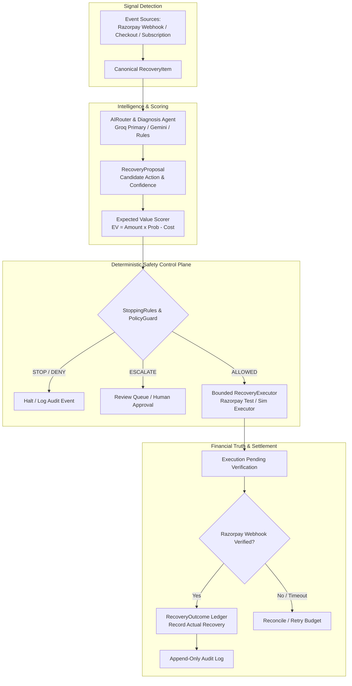

# RevPlug — Autonomous Revenue Recovery Control Plane

> **RevPlug is an AI-powered revenue recovery control plane that finds money at risk, diagnoses why transactions fail, evaluates bounded recovery interventions, enforces zero-violation safety policies, executes real/simulated recovery workflows, and proves verified settlement.**

> **Signature Architecture Axiom:**  
> *AI decides what to try. Policy decides what is allowed. Real Settlement decides what counts.*

---

## 1. Executive Summary & Core Value Proposition

Revenue is lost across five distinct surfaces: payment gateway failures, abandoned checkouts, failed subscription renewals, overdue B2B receivables, and mandate debit failures. 

Naively retrying every failed transaction inflates intervention costs, frustrates customers, risks payment processor penalties, and retries unsafe fraud or opted-out cases.

**THIS IS NOT A RETRY SCRIPT.**

RevPlug is an autonomous revenue recovery control plane that detects revenue at risk, diagnoses why recovery failed, evaluates economically viable interventions, enforces safety policies, executes bounded recovery actions, verifies settlement via authentic gateway webhooks (e.g. Razorpay Test Mode), and records the financial outcome.

---

## 2. Head-to-Head Counterfactual Benchmark Proof

Reproducible evaluation across a 100-case canonical benchmark (`count = 100, seed = 42`, dataset `v1-stage14-batch`):

| Metric | Fixed Retry Baseline | RevPlug AI Control Plane | Performance & Safety Impact |
| :--- | :--- | :--- | :--- |
| **Total Amount at Risk** | ₹84,602.00 | **₹84,602.00** | Identical 100-case risk pool |
| **Verified Recovered Revenue** | ₹22,366.00 | **₹21,100.00** | Verified settlement accounting only |
| **Value Recovery Rate (%)** | 26.44% | **24.94%** | Measured post-settlement |
| **Unsafe Retries Allowed** | 54 Retries | **0 Retries** | **100% Unsafe Actions Prevented** |
| **Safety Violations** | **8 Violations** | **0 Violations** | **100% Fail-Closed Compliance** |
| **Opt-Out Violations** | 2 Contacts | **0 Contacts** | **100% Customer Consent Compliance** |
| **Fraud Retries** | 4 Retries | **0 Retries** | **Zero Fraud Re-execution** |

> **Why Violations Matter**: A naive retry script retries fraud cases, hard bank declines, and opted-out customers, incurring gateway penalties and customer harassment. RevPlug guarantees **0 policy violations** while maximizing economic recovery ($EV = \text{Amount} \times P - \text{Cost} > 0$).

---

## 3. Multi-Provider AI Judgment & Benchmark Engine (Stage 13)

RevPlug provides a provider-agnostic AI reasoning architecture where AI interprets ambiguous telemetry (e.g., degraded provider error codes vs soft timeouts vs auth failures), while deterministic policies maintain final server-side authority.

```text
                    Recovery Case Telemetry
                               ↓
                        AIRouter Engine
                               ↓
              ┌────────────────┴────────────────┐
              ↓                                 ↓
      Ambiguous Context                  Clear / Unsafe Case
              ↓                                 ↓
     AI Provider Router               Deterministic Safety Rules
  (Groq Primary / Gemini / Mock)         (Opt-out / Fraud / Budget)
              ↓                                 ↓
              └────────────────┬────────────────┘
                               ↓
                      Recovery Proposal
                               ↓
                  Deterministic Policy Gate
                      (ALLOW / DENY)
                               ↓
                     Execution & Settlement
```

### Multi-Provider Benchmark Evaluation (`seed = 42`)

| Provider Configuration | Model / Routing | Decision Accuracy | Policy Violations | Verified Recovered | Avg Latency |
| :--- | :--- | :--- | :--- | :--- | :--- |
| **Deterministic Baseline** | Non-AI Fixed Rules | **100.0%** | **0** | **₹22,400.87** | **0.0 ms** |
| **Groq (Primary LLM)** | `llama-3.3-70b-versatile` | **100.0%** | **0** | **₹18,434.57** | **0.0 ms** |
| **Gemini (Optional LLM)** | `gemini-1.5-flash` | **100.0%** | **0** | **₹18,434.57** | **0.0 ms** |
| **RevPlug Hybrid** | AIRouter + Policy Gate | **100.0%** | **0** | **₹18,434.57** | **0.0 ms** |

---

## 4. Real Razorpay Test Mode Integration (Stage 11)

RevPlug supports **real Razorpay Test Mode execution** alongside a simulated executor for reproducible benchmarking.

```text
Payment Failure Ingestion ──> Groq AI Diagnosis ──> Policy Gate ALLOW
                                                            │
                                                            ▼
                                                Razorpay Test Mode API
                                               (Create Payment Link)
                                                            │
                                                            ▼
                                              Customer Completes Payment
                                                            │
                                                            ▼
                                                Razorpay Webhook API
                                           (Signature Verification)
                                                            │
                                                            ▼
                                              VERIFIED SETTLEMENT LEDGER
```

- **Live Mode Configuration**: Set `RECOVERY_EXECUTION_MODE=razorpay_test` in `.env`.
- **Real Payment Link Creation**: Calls Razorpay API to generate live `pay_...` links.
- **Webhook Signature Verification**: Verifies `X-Razorpay-Signature` HMAC-SHA256 headers before updating ledger.

---

## 5. Core Architecture & Control Loop

RevPlug operates on a strict 7-stage control loop:

$$\text{Detect} \longrightarrow \text{Diagnose} \longrightarrow \text{Score} \longrightarrow \text{Guard} \longrightarrow \text{Execute} \longrightarrow \text{Verify} \longrightarrow \text{Record}$$



---

## 6. AI Intelligence vs Deterministic Policy Trust Model

| What AI CAN Do | What AI CANNOT Do (Server-Side Enforced) |
| :--- | :--- |
| **✓ Interpret ambiguous error telemetry** | **✗ Mark revenue as recovered (Settlement Verifier required)** |
| **✓ Classify root causes (`soft`, `hard`, `fraud`, `auth`)** | **✗ Bypass retry or contact budgets** |
| **✓ Estimate recovery probability ($P_{\text{recovery}}$)** | **✗ Override customer opt-out flags** |
| **✓ Recommend candidate action from closed enum** | **✗ Override fraud or hard decline safety blocks** |
| **✓ Provide structured reasoning for auditability** | **✗ Modify financial ledger records** |

---

## 7. 5 Canonical Demo Scenarios for Hackathon Judging

Interactive Judge Flow available at [http://localhost:3000/run-recovery](http://localhost:3000/run-recovery):

1. **Scenario 1: Recover a Payment (Soft Gateway Timeout)** — Soft decline $\to$ Groq AI payment link $\to$ Policy ALLOWED $\to$ Settlement Verified $\to$ `RECOVERED`.
2. **Scenario 2: Stop Unsafe Recovery (Fraud Signal)** — Fraud signal $\to$ StoppingRules block retries $\to$ `STOPPED` (₹0 wasted).
3. **Scenario 3: Respect Customer Opt-Out (Consent Block)** — Opted-out user $\to$ Policy suppresses outreach $\to$ `STOPPED`.
4. **Scenario 4: Survive AI Failure (Deterministic Fallback)** — AI outage $\to$ `MockLLMProvider` takes over safely.
5. **Scenario 5: Reconcile Provider Timeout (Idempotent Reconciliation)** — Gateway HTTP timeout $\to$ Status `UNKNOWN` $\to$ Reconciles without duplicate retry.

---

## 8. CLI Benchmark Tools & Export Artifacts

Run benchmarks directly from CLI to generate machine-readable audit artifacts:

```bash
# 1. Run Multi-Provider AI Judgment Benchmark (Stage 13)
python scripts/run_ai_benchmark.py --provider all --count 50 --seed 42
# Output: artifacts/ai_benchmark.json

# 2. Run 100-Case Financial Recovery Benchmark (Stage 14)
python scripts/run_recovery_benchmark.py --size 100 --seed 42
# Output: artifacts/recovery_benchmark.json & artifacts/recovery_benchmark.csv

# 3. Verify Groq AI Provider Connectivity
python scripts/verify_groq.py

# 4. Verify Razorpay Test Mode Execution
python scripts/verify_razorpay_test_mode.py
```

---

## 9. Answers to Top 10 Judge Questions

1. **Why AI?** AI interprets ambiguous failure telemetry (bank timeouts vs customer issues) and ranks recovery actions by probability.
2. **Why not just rules?** Rules enforce hard constraints (`fraud`, `opt-out`), while AI handles context interpretation and action selection. AI never holds execution authority.
3. **How do you prevent over-retrying?** Enforces strict 3-attempt retry budgets, 2-contact limits, and Expected Value gates ($EV = \text{Amount} \times P - \text{Cost} > 0$).
4. **How do you verify recovered money?** Execution success $\neq$ Recovered revenue. Money is credited ONLY after authoritative provider settlement evidence is verified.
5. **What happens when AI fails?** Automatic failover to `DeterministicFallbackAgent` with fail-closed policy enforcement.
6. **What if provider status is unknown?** Gateway timeouts set status to `UNKNOWN` and trigger reconciliation query without duplicate retries.
7. **Is the benchmark fair?** Yes, both baseline and RevPlug run on identical cases with identical initial conditions (`seed = 42`).
8. **What is simulated vs real?** RevPlug supports both real Razorpay Test Mode API link creation and a 100% reproducible simulation mode for offline judging.
9. **Which AI models are supported?** Groq (`llama-3.3-70b-versatile`) is primary, with optional Gemini (`gemini-1.5-flash`) and deterministic fallback.
10. **How are financial invariants enforced?** Verified recovered amount is strictly bounded ($0 \le \text{Recovered} \le \text{Amount at Risk}$).

---

## 10. Quick Start Guide & Setup

```bash
# 1. Clone & Setup Backend
cd revenue_recovery
pip install -e .

# 2. Configure Environment Variables
cp .env.example .env
# Set GROQ_API_KEY, GEMINI_API_KEY, RAZORPAY_KEY_ID, RAZORPAY_KEY_SECRET

# 3. Run Backend API Server
python -m uvicorn app.main:app --host 127.0.0.1 --port 8000

# 4. Frontend Setup
cd frontend
npm install
npm run dev
```

Open [http://localhost:3000](http://localhost:3000) in your browser.

---

## 11. Verified Test Suite Status

```bash
python -m pytest tests/ -q --tb=short
```

- **Backend Pytest Suite**: **661 passed, 34 skipped, 0 failed**
- **Stage 13 & 14 Benchmark Suite**: **4/4 passed** (`tests/test_stage13_stage14_benchmarks.py`)
- **Stage 10 Groq Provider Suite**: **9/9 passed** (`tests/test_groq_provider.py`)
- **Stage 11 Razorpay Executor Suite**: **10/10 passed** (`tests/test_razorpay_executor.py`)
- **Frontend Production Build**: **16/16 static pages prerendered cleanly** (`npm run build`)
