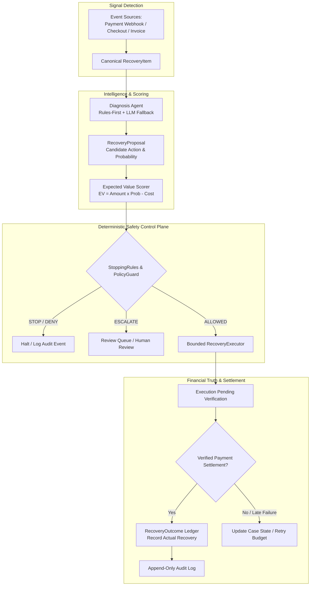

# RecoverOS — Autonomous Revenue Recovery Control Plane

> **Autonomous revenue recovery control plane enforcing deterministic policy safety, financial value scoring, and verified outcome settlement.**

---

## 1. What is RecoverOS?

Revenue is lost across five distinct surfaces: payment gateway failures, abandoned checkouts, failed subscription renewals, overdue B2B receivables, and mandate debit failures. 

Naively retrying every failed transaction inflates intervention costs, frustrates customers, risks payment processor penalties, and retries unsafe fraud or opted-out cases.

**THIS IS NOT A RETRY SCRIPT.**

RecoverOS is an autonomous revenue recovery control plane that detects revenue at risk, diagnoses why recovery failed, evaluates economically viable interventions, enforces safety policies, executes bounded recovery actions, verifies settlement, and records the financial outcome.

The system intelligently decides:
- **`RECOVER`**: Retry payment with exponential backoff on soft declines.
- **`CHANGE CHANNEL`**: Switch to payment link via SMS/Email on hard declines or 3DS authentication requirements.
- **`STOP`**: Halt recovery immediately on fraud, opt-outs, expired deadlines, or negative net expected value.
- **`ESCALATE`**: Route complex or high-value cases to human review with structured evidence.
- **`DO NOTHING`**: Avoid intervention when transaction value does not justify execution cost.

---

## 2. Core Control Loop & Architecture

RecoverOS operates on a strict 7-stage control loop:

$$\text{Detect} \longrightarrow \text{Diagnose} \longrightarrow \text{Score} \longrightarrow \text{Guard} \longrightarrow \text{Execute} \longrightarrow \text{Verify} \longrightarrow \text{Record}$$



### Architectural Axiom: Proposal vs. Execution Privilege
- **LLM / AI Agent Proposes**: The LLM analyzes failure telemetry, classifies root causes, and proposes candidate recovery actions. **The LLM holds ZERO execution privilege.**
- **Deterministic Control Plane Decides**: Pure deterministic code—policy safety guards, stopping rules, proposal validation, expected-value scoring, and payment settlement verification—holds sole execution and financial authority.

---

## 3. Supported Revenue Surfaces

RecoverOS supports five canonical revenue surfaces:

| Revenue Surface | Signal Detected | Diagnosis | Candidate Interventions | Safety Constraints |
| :--- | :--- | :--- | :--- | :--- |
| **1. Payment Gateway Failures** | Gateway `payment.failed` webhook (Razorpay, Stripe) | `soft` timeout, `hard` decline, `fraud` check failure | `retry_payment`, `send_payment_link`, `escalate_human` | Maximum 3 retries; fraud/opt-out blocked; hard declines prohibit card retries |
| **2. Checkout Abandonment** | Cart drop-off event / abandoned checkout | `checkout_abandoned` | `send_payment_link`, `send_reminder`, `stop_recovery` | Cart age $> 7$ days stops recovery; converted carts halt immediately |
| **3. Subscription Renewal** | Recurring token billing failure | `soft` token error, `authentication_required` | `retry_payment`, `send_payment_link`, `stop_recovery` | Cancelled subscriptions or active promise-to-pay pause automated retries |
| **4. Overdue B2B Receivables** | Invoice aging threshold crossed | `invoice_overdue` | Deterministic aging ladder (`send_reminder` $\to$ `send_payment_link` $\to$ `alternate_channel` $\to$ `escalate_human`) | Disputed or written-off invoices stop recovery immediately |
| **5. NACH / e-Mandate Failures** | Bank auto-debit decline | `mandate_failed` | `retry_payment` (if eligible), `send_payment_link` | Mandate retry rules check bank return codes and attempt budget |

> **Note on Execution Layer**: Provider execution and gateway settlement events in this demo are deterministically simulated (`SimulatedRecoveryExecutor`) to enable reproducible judging without requiring live third-party credentials.

---

## 4. AI Intelligence & Trust Boundary

### Concrete AI Role
The AI decision agent (`RealRecoveryDecisionAgent` / `MockRecoveryDecisionAgent`) performs five specific tasks:
1. Interprets raw gateway failure telemetry and error codes.
2. Classifies likely root cause (`soft`, `hard`, `fraud`, `authentication_required`, `unknown`).
3. Estimates base recovery probability ($P_{\text{recovery}}$).
4. Recommends a candidate action from a closed action enum.
5. Provides structured reasoning and evidence citations for auditability.

### Trust Boundary & Fail-Closed Validation
The model output is parsed into a strict Pydantic `RecoveryProposal` schema:
- **Closed Action Enum**: `retry_payment`, `send_payment_link`, `send_reminder`, `send_customer_message`, `alternate_channel`, `promise_to_pay`, `escalate_human`, `stop_recovery`, `no_action`.
- **Fail-Closed Validation**: Any invalid action (e.g. `give_50_percent_discount`) triggers a `ProposalValidationError` and falls back to deterministic rule classification.
- **Unoverrideable Guardrails**: Even if an LLM recommends `retry_payment` on a fraud item, `DefaultRecoveryGuard` intercepts the proposal and returns `STOP`.

---

## 5. Financial Decisioning & Expected Value ($EV$)

RecoverOS prevents unprofitable interventions by evaluating Expected Value ($EV$) before dispatching actions:

$$EV = (\text{Amount at Risk} \times P_{\text{recovery}}) - C_{\text{intervention}}$$

Where:
- $\text{Amount at Risk}$: Transaction value in minor currency units (e.g. paise).
- $P_{\text{recovery}}$: Base recovery probability derived from failure category, action, and attempt count.
- $C_{\text{intervention}}$: Execution cost model (e.g. `retry_payment`: ₹5.00, `send_payment_link`: ₹2.00, `send_reminder`: ₹1.50, `escalate_human`: ₹10.00).

### Numerical Example (Real Repository Values)
- **Soft Payment Failure (₹500.00 / 50,000 paise)** with `retry_payment`:
  $$EV = (50,000 \times 0.70) - 500 = 34,500 \text{ paise} = \mathbf{+\text{₹}345.00} \quad (\text{Allowed})$$
- **Micro Subscription Failure (₹1.50 / 150 paise)** with `retry_payment`:
  $$EV = (150 \times 0.70) - 500 = -395 \text{ paise} = \mathbf{-\text{₹}3.95} \quad (\text{Blocked by EV Gate})$$

---

## 6. Safety, Compliance & Stopping Rules

RecoverOS enforces server-side fail-closed safety. Safety rules cannot be bypassed by frontend requests or human operator overrides.

### Core Safety Rules
1. **Fraud Stop**: `fraud_detected` halts recovery immediately (`decision = STOP`).
2. **Hard Decline Policy**: Prohibits card retries on hard bank declines.
3. **Customer Opt-Out**: Customers with `customer_opted_out = True` suppress all outbound interventions.
4. **Retry Budget**: Maximum 3 attempt limit halts further retries (`retry_budget_exhausted`).
5. **Active Promise-to-Pay**: Active promise pauses automated retries until promise date.
6. **Terminal State Absorbing**: `RECOVERED` and `STOPPED` states reject all outbound transitions.
7. **Human Approval Protection**: Endpoint `POST /api/recovery-items/{id}/approve` re-evaluates `DefaultRecoveryGuard`. Approving a prohibited item returns `status = denied_by_policy`.

---

## 7. Financial Truth & Ledger Architecture

RecoverOS enforces strict financial accounting: **Execution Success $\neq$ Recovered Revenue**.

- **Authoritative Ledger**: All money metrics derive strictly from `RecoveryOutcome` records (`SUM(actual_recovery_minor)`).
- **Execution vs Settlement**: Dispatching an action logs an `ExecutionResult` (`intervention_executed`) but does NOT increment actual recovered revenue until verified settlement is recorded.
- **Integer Minor Units**: All monetary values are processed as 64-bit integers (`amount_minor`, `actual_recovery_minor`, `recovery_cost_minor`) to eliminate floating-point rounding errors.
- **Idempotency**: Outcome persistence uses DB `ON CONFLICT (recovery_item_id) DO UPDATE SET` to prevent double-counting.

---

## 8. Benchmark Evaluation: RecoverOS vs. Baseline

RecoverOS includes a live benchmark evaluation engine (`/batch-recovery`) comparing RecoverOS policy-driven intelligence against a fixed retry baseline on the **EXACT SAME dataset**.

### Golden Run Results (`count = 50, seed = 42`, dataset `v2-counterfactual`)

| Metric | Fixed Retry Baseline | RecoverOS Control Plane | Performance & Safety Impact |
| :--- | :--- | :--- | :--- |
| **Opportunities Processed** | 50 cases | 50 cases | Same deterministic dataset |
| **Total Amount at Risk** | ₹42,674.00 | ₹42,674.00 | 100% Identical risk pool |
| **Gross Recovered Revenue** | ₹13,363.00 | **₹19,550.00** | **+₹6,187.00 (+46.3% gross recovery)** |
| **Intervention Cost** | ₹430.00 | **₹115.00** | **73.3% cost reduction** |
| **Net Revenue Recovered** | ₹12,933.00 | **₹19,435.00** | **+₹6,502.00 (+50.3% net recovery)** |
| **Value Recovery Rate** | 31.3% | **45.8%** | **+14.5% higher value recovery** |
| **Safety Violations** | **17 Violations** | **0 Violations** | **100% Safety Compliance** |
| **Cost Per Rupee Recovered**| ₹0.0322 / ₹ | **₹0.0059 / ₹** | **5.5x more cost-efficient** |

*Why Policy Violations Matter*: The fixed baseline suffers **17 safety violations** (retrying fraud, hard declines, and opted-out customers), risking merchant processor suspensions and compliance fines. RecoverOS achieves superior gross and net recovery with **0 policy violations**.

---

## 9. Reproducibility & Golden Evaluation Command

Run the benchmark evaluation twice to verify 100% seeded determinism:

```bash
python -c "from app.services.evaluation_service import EvaluationService; s = EvaluationService(); r = s.run_batch_evaluation(50, 42); print(f'Recovered: INR {r.recoveros.actual_recovered/100:.2f} | Net: INR {r.recoveros.net_recovered/100:.2f} | Rate: {r.recoveros.recovery_rate*100:.1f}% | Cost: INR {r.recoveros.intervention_cost/100:.2f} | Violations: {r.recoveros.safety_violations[\"total_safety_violations\"]}')"
```

**Expected Deterministic Output**:
```text
Recovered: INR 19550.00 | Net: INR 19435.00 | Rate: 45.8% | Cost: INR 115.00 | Violations: 0
```

---

## 10. Golden Demo Cases for Judge Walkthrough

| Demo Objective | Case ID | Revenue Surface | Amount at Risk | Action & Safety Decision | Outcome | Why It Matters for Judging |
| :--- | :--- | :--- | :--- | :--- | :--- | :--- |
| **Best Money Recovery** | `eval_42_0036` | `PAYMENT_FAILURE` | ₹10,000.00 | `retry_payment` (ALLOWED) | **RECOVERED** | Demonstrates clean recovery on a high-value soft decline. |
| **Best AI Decision** | `eval_42_0027` | `AUTHENTICATION_REQUIRED` | ₹5,000.00 | `send_payment_link` (ALLOWED) | **RECOVERED** | Shows AI switching from forbidden card retry to payment link. |
| **Best Safety Block** | `eval_42_0003` | `PAYMENT_FAILURE` | ₹2,500.00 | `stop_recovery` (STOP) | **STOPPED** | Proves fail-closed safety stopping automated retries on fraud. |
| **Best Escalation** | `eval_42_0007` | `CHECKOUT_ABANDONMENT` | ₹50.00 | `escalate_human` (ESCALATE) | **ESCALATED** | Shows structured handoff to human review queue. |
| **Best Negative EV** | `eval_42_0002` | `SUBSCRIPTION_FAILURE` | ₹1.50 | `stop_recovery` (STOP) | **STOPPED** | Proves EV gate blocks attempts where cost > expected value. |

---

## 11. Judge Walkthrough & UI Map

Inspect the Next.js control center (`http://localhost:3000`):

1. **Dashboard (`/dashboard`)**: View executive summary of Revenue at Risk, Actually Recovered, and Recovery Rate.
2. **Benchmark Engine (`/batch-recovery`)**: Run live 50-case benchmark (`seed = 42`). Observe **0 Safety Violations** for RecoverOS vs **19 Unsafe Retries** for Baseline.
3. **Money Case Workspace (`/recovery/eval_42_0036`)**: Inspect the 8-stage audit timeline (`01 EVENT` $\to$ `08 OUTCOME`).
4. **Safety Block Case (`/recovery/eval_42_0003`)**: Inspect fraud safety stop timeline proving fail-closed policy controls.
5. **Review Queue (`/review`)**: Inspect human review queue displaying evidence handoffs and policy re-evaluation on approval.
6. **Customer History (`/customers`)**: View customer-level context, active promises, and chronological recovery events.

---

## 12. Complete Auditability

Every recovery case produces an immutable audit stream viewable in the UI case workspace:

```text
01 EVENT       │ payment.failed webhook received (amount: ₹10,000.00)
02 DIAGNOSE    │ Classifying root cause -> 'soft' (confidence: 0.95)
03 SCORE       │ EV Calculated: ₹6,995.00 (prob: 0.70, cost: ₹5.00)
04 RECOMMEND   │ AI Agent proposed 'retry_payment'
05 SAFETY      │ PolicyGuard evaluated -> ALLOWED (rule: soft_retry_allowed)
06 EXECUTE     │ RecoveryExecutor dispatched 'retry_payment' (attempt 1)
07 VERIFY      │ Holding in pending_verification for gateway settlement
08 OUTCOME     │ Settlement verified -> RecoveryOutcome recorded (₹10,000.00)
```

---

## 13. Failure & Edge Case Resilience

- **Malformed LLM Output**: Pydantic schema validation catches invalid JSON/actions and falls back to deterministic rule classification (`diagnosis_path = "fallback"`).
- **Duplicate Webhooks**: Event ID deduplication returns `duplicate` status without creating duplicate items or ledger entries.
- **Out-of-Order Webhooks**: Terminal state absorption prevents late failure webhooks from altering `RECOVERED` or `STOPPED` cases.
- **Provider Outage**: Execution failures log `temporary_failure` and schedule backoff retries without corrupting financial records.

---

## 14. Simulation Disclosure

**Transparency Note**: External payment gateway settlements, SMS link dispatches, and email notifications in this demo are deterministically simulated (`SimulatedRecoveryExecutor`). This design ensures **100% reproducible judging** without external API keys or real money movement. The underlying control plane architecture is provider-agnostic and ready for live Stripe/Razorpay SDK integration.

---

## 15. Quick Start Guide

### Prerequisites
- Python 3.11+
- Node.js 18+ & npm

### 1. Backend Setup
```bash
cd revenue_recovery

# Install dependencies
pip install -e .

# Set environment (defaults to in-memory persistence)
$env:PYTHONPATH = (Get-Location).Path

# Start FastAPI server
python -m uvicorn app.main:app --host 127.0.0.1 --port 8000
```

### 2. Frontend Setup
```bash
cd revenue_recovery/frontend

# Install & start Next.js dev server
npm install
npm run dev
```
Open [http://localhost:3000](http://localhost:3000) in your browser.

---

## 16. Verified Test Suite Status

```bash
python -m pytest tests/ -q --tb=short
```

- **Backend Pytest Suite**: **439 passed, 32 skipped, 0 failed**
  *(32 skipped tests are PostgreSQL integration tests requiring a live PostgreSQL instance on port 5432)*
- **Frontend Production Build**: **16/16 static pages generated cleanly** (`npm run build`)

---

## 17. Why RecoverOS Wins

1. **Closed-Loop Execution**: Moves beyond detection-only dashboards to bounded autonomous execution.
2. **Economic Intelligence**: Uses Expected Value ($EV$) to prevent unprofitable interventions.
3. **Fail-Closed Safety**: AI proposes, but deterministic policy guardrails hold sole execution authority.
4. **Financial Ledger Truth**: Realized recovery is recorded strictly upon verified settlement.
5. **Head-to-Head Benchmark**: Includes built-in evaluation engine proving superior net value and 0 safety violations against fixed retries.
6. **100% Reproducibility**: Seeded evaluation produces identical, verifiable metrics every time.

---

## 18. Limitations & Production Roadmap

- **Simulated Provider Execution**: Production deployment requires replacing `SimulatedRecoveryExecutor` with live Stripe / Razorpay / Twilio API adapters.
- **PostgreSQL Connection Pool**: Production deployment uses PostgreSQL mode (`PERSISTENCE_MODE=postgres`).
